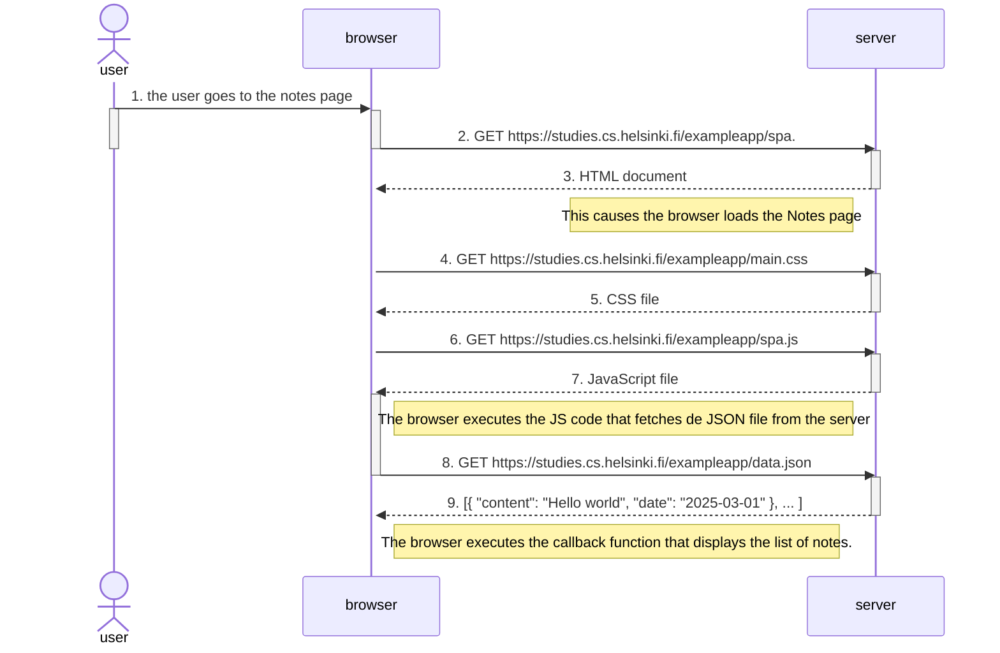

```mermaid


sequenceDiagram
    Actor user
    participant browser
    participant server


    user->>browser: 1. the user goes to the notes page
    activate user
    activate browser
    activate browser

    browser->>server: 2. GET https://studies.cs.helsinki.fi/exampleapp/spa.
    deactivate user
    deactivate browser
    activate server
    server-->>browser: 3. HTML document
    deactivate server
    Note left of server: This causes the browser loads the Notes page

    browser->>server: 4. GET https://studies.cs.helsinki.fi/exampleapp/main.css
    activate server
    server-->>browser: 5. CSS file
    deactivate server

    browser->>server: 6. GET https://studies.cs.helsinki.fi/exampleapp/spa.js
    activate server
    server-->>browser: 7. JavaScript file
    deactivate server
    activate browser
    Note right of browser: The browser executes the JS code that fetches de JSON file from the server

    browser->>server: 8. GET https://studies.cs.helsinki.fi/exampleapp/data.json
    deactivate browser
    activate server
    server-->>browser: 9. [{ "content": "Hello world", "date": "2025-03-01" }, ... ]
    deactivate server

    Note right of browser: The browser executes the callback function that displays the list of notes.
```
