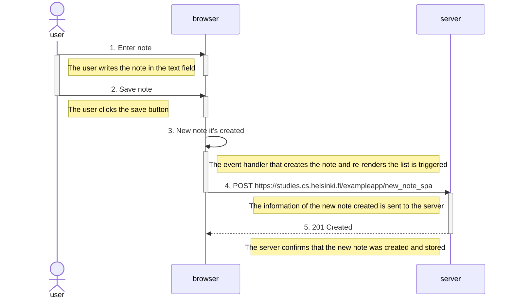

```mermaid


sequenceDiagram
    Actor user
    participant browser
    participant server


    user->>browser: 1. Enter note
    activate user
    activate browser
    Note right of user: The user writes the note in the text field
    deactivate browser
    user->>browser: 2. Save note
    deactivate user
    activate browser
    Note right of user: The user clicks the save button

    deactivate browser
    browser ->>browser: 3. New note it's created
    activate browser
    Note right of browser: The event handler that creates the note and re-renders the list is triggered


    browser->>server: 4. POST https://studies.cs.helsinki.fi/exampleapp/new_note_spa
    deactivate browser
    activate server
    Note left of server: The information of the new note created is sent to the server


    server-->>browser: 5. 201 Created
    deactivate server
    Note left of server: The server confirms that the new note was created and stored

    activate browser

```
