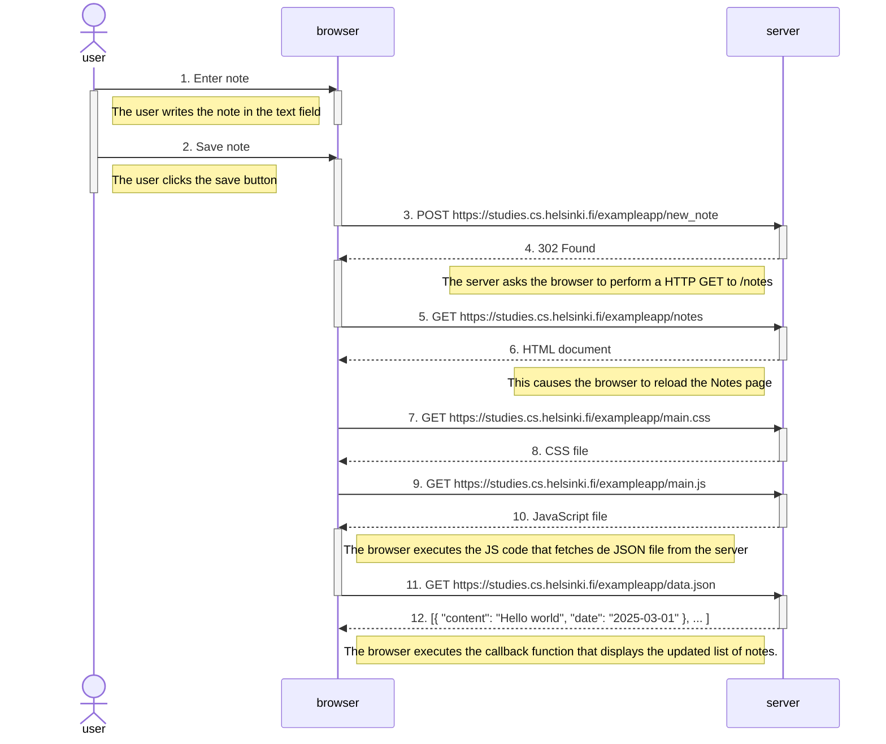

```mermaid


sequenceDiagram
    Actor user
    participant browser
    participant server


    user->>browser: 1. Enter note
    activate user
    activate browser
    Note right of user: The user writes the note in the text field
    deactivate browser
    user->>browser: 2. Save note
    activate browser
    Note right of user: The user clicks the save button
    deactivate user

    browser->>server: 3. POST https://studies.cs.helsinki.fi/exampleapp/new_note
    deactivate browser
    activate server
    server-->>browser: 4. 302 Found
    deactivate server
    activate browser
    Note left of server: The server asks the browser to perform a HTTP GET to /notes


    browser->>server: 5. GET https://studies.cs.helsinki.fi/exampleapp/notes
    deactivate browser
    activate server
    server-->>browser: 6. HTML document
    deactivate server
    Note left of server: This causes the browser to reload the Notes page

    browser->>server: 7. GET https://studies.cs.helsinki.fi/exampleapp/main.css
    activate server
    server-->>browser: 8. CSS file
    deactivate server

    browser->>server: 9. GET https://studies.cs.helsinki.fi/exampleapp/main.js
    activate server
    server-->>browser: 10. JavaScript file
    deactivate server
    activate browser
    Note right of browser: The browser executes the JS code that fetches de JSON file from the server

    browser->>server: 11. GET https://studies.cs.helsinki.fi/exampleapp/data.json
    deactivate browser
    activate server
    server-->>browser: 12. [{ "content": "Hello world", "date": "2025-03-01" }, ... ]
    deactivate server

    Note right of browser: The browser executes the callback function that displays the updated list of notes.
```
